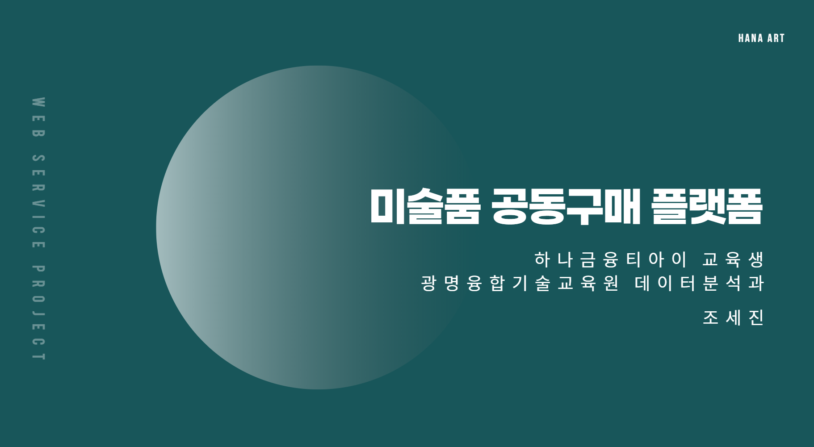
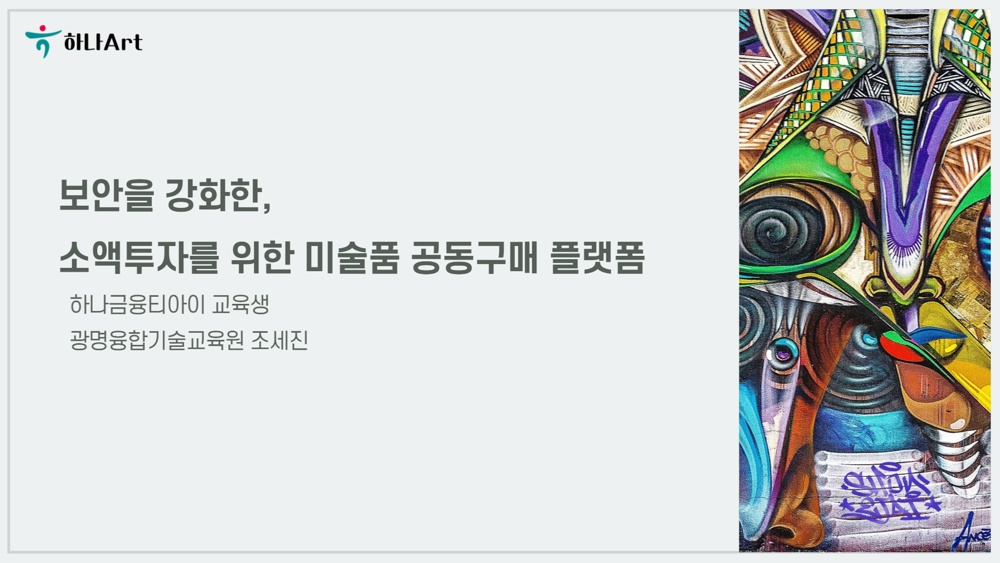

# 하나아트 : 보안을 강화한, 소액투자를 위한 미술품 공동구매 플랫폼

[프로젝트 홈페이지 - https://koposoftware.github.io/template/](https://koposoftware.github.io/template/)

# 1. 프로젝트 개요

"하나아트 : 보안을 강화한, 소액투자를 위한 미술품 공동구매 플랫폼" 프로젝트는 아트테크가 새로운 투자수단으로 관심을 얻고 있어서 다양한 사람들이 접근하기 쉽도록 소액으로도 투자가 가능한 미술품 공동구매 플랫폼입니다. 미술품 공동구매를 위한 전체적인 프로세스를 구현했고, 보안을 강화하고 투명하게 거래내역을 공개하여 사용자들에게 신뢰있는 플랫폼을 제공하는 것이 목적입니다.

데이터의 유실이나 조작에 대한 우려로 인하여 블록체인의 형태로 조각 거래내역을 저장하여 소장이력을 투명하게 공개해놓았습니다.  이를 통하여 사용자들이 안전하게 아트테크를 진행할 수 있고 사용자들에게 신뢰를 얻을 수 있습니다.

또한, 타 플랫폼의 경우 사용자가 예치금을 직접 입금해야하고 예치금 입금 확인을 위한 소요시간이 걸리는 반면에 하나아트는 자동이체 서비스를 제공하여 이체의 번거로움을 해결하였습니다.

# 2. 하나아트의 서비스

### 고객 - 금융 관련 서비스

- **계좌 조회**
  - 오픈뱅킹 서버스를 통하여 전체 계좌를 조회하고 거래내역을 조회할 수 있습니다.
- **예치금 자동이체 설정**
  - 원하는 금액이 매일 자동으로 이체되도록 설정할 수 있습니다.
- **예치금 이체**
  - 자동이체가 아닌 사용자가 직접 예치금 이체를 진행할 수 있습니다.
- **예치금 조회**
  - 이체된 예치금의 내역을 확인할 수 있습니다.

### 고객 - 미술품 공동구매 관련 서비스

- **공동구매 작품 조회**
  - 공동구매로 등록된 작품들을 확인할 수 있습니다.
- **미술품 조각 구매**
- **소유자 현황**
  - 공동구매가 완료되고 각 작품의 소유자 현황과 구매 조각의 수를 확인할 수 있습니다.
- **매각 진행현황**
  - 매각 중이거나 매각 완료된 작품들의 현황 및 수익률을 확인할 수 있습니다.
- **구매내역 확인**
- **온라인 권리증 확인**
  - 각 작품마다 총 구매한 개수, 마지막 구매 날짜, 작품의 ID 등을 확인할 수 있습니다.
- **매각 작품 수익률 확인**
  - 매각이 완료된 작품의 수익률을 확인할 수 있고, 작품마다의 구매한 조각 비율과 각 작품의 수익률을 그래프로 확인할 수 있습니다.

### 고객 - 아트스캔

- **전체 Block 조회**
  - 블록체인의 형태로 저장된 거래내역의 모든 Block 정보를 확인할 수 있습니다.
- **전체 Transaction 조회**
  - 블록체인의 형태로 저장된 거래내역의 모든 Transaction 정보를 확인할 수 있습니다.
- **address 검색**
  - 사용자의 address를 검색하여 전체 거래 내역을 확인할 수 있습니다.

### 관리자

- **작가 등록**
- **작품 등록**
- **작품 관리**
  - 매각 투표 진행
  - 매각 투표 결과 확인
  - 수익 분배
  - 매각 완료
- **공지 등록**
- **통계** 
  - 로그데이터를 활용하여 시간대별 로그인 횟수, 클릭 횟수가 많은 작품 등의 그래프를 확인할 수 있습니다.
  - 사용자 관련 통계 정보를 그래프로 확인할 수 있습니다.

# 3. 프로젝트 제안서

[발표자료](/하나아트_제안서.pdf) 

# 4. 사용 기술

- 오픈뱅킹 서비스 사용 시 OAuth의 인증방식과 JWT Token을 사용하여 권한 확인
- 블록체인 형태를 구현하여 거래내역 저장
- 협업필터링을 사용한 작품 추천 서비스 (R 연동)
- 아트테크 관련 기사 Crawling
- Web-Socket을 사용한 실시간 알림
- Java Scheduler를 활용한 예치금 자동이체
- Spring MailSender, CoolSMS API를 사용한 이메일, 문자 알림
- 카카오 API를 사용한 카카오 메시지
- PL/SQL을 사용하여 이체 함수 생성
- log4j - 로그 데이터 관리
- Spring MVC 기반 웹 애플리케이션 제작
- chart.js 수익률, 로그데이터 그래프
- 주소API 회원가입
- Spring Tiles로 view 구성

# 5. 프로젝트 결과

### 발표 ppt 

[발표자료](/하나아트_미술품공동구매플랫폼_조세진_발표.pdf) 

### 시연 동영상 

<iframe width="640" height="400" src="https://www.youtube.com/embed/qSwVssVAg8I" title="YouTube video player" frameborder="0" allow="accelerometer; autoplay; clipboard-write; encrypted-media; gyroscope; picture-in-picture" allowfullscreen></iframe>

# 6. 본인 소개

 

| 이름            | 조세진                                                       |
| --------------- | ------------------------------------------------------------ |
| 연락처          | whtpwls777@naver.com                                         |
| Language & Tool | Java, Javascript, Python, R, HTML, CSS, SAS, SQL, PL/SQL     |
| 자격증          | 정보처리기사, SQLD, ADSP, 사회조사분석사 2급, 컴퓨터활용능력1급 |
| 수상            | 코레일 사용자 편의를 위한 아이디어 공모전(1등)               |
| 특기사항        | Women in FinTech 아카데미 수료 한국과학기술기획평가원(KISTEP) 인턴(2019.05 ~ 2019.12) - 시스템 개발 및 감리 관리  월드비전 꿈디자이너 사업의 꿈꾸는 서포터즈 활동 크리노베이션링크 인턴(2017.09~2018.03) |
| 교육이수        | 제품 불량 탐지를 위한 스마트팩터리 빅데이터 전문가 양성과정(2020.04-2020.10) 파이썬을 활용한 머신러닝실무(2019.08 - 2019.09) |

# 홈페이지 설정 나 왜 이거 안되는거지 ㅠ
 본인 repository에서 "Setting"를 들어가서 GitHub Pages에서 설정 변경.
* Source
 Source에서 원하는 branch와 directory 설정한다. 
 기본값은 master 에 root를 설정 
 Save 버튼 꼭 누른다.

 * Theme Chooser
 theme을 변경하여 좀더 이쁜 홈페이지를 만든다.
   
    

